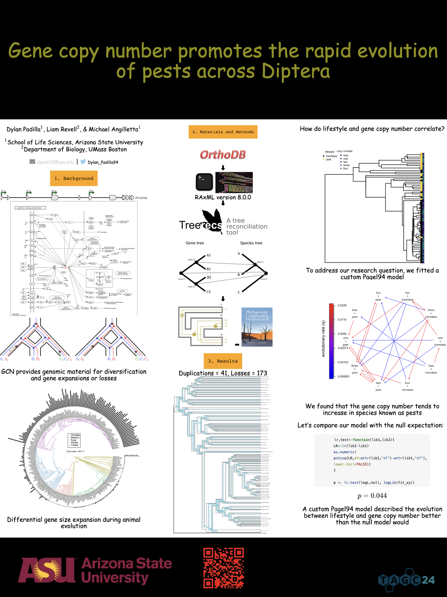

```{css, include = FALSE}

.title-slide h1 {
    
    margin-top: -50px;
    font-style: italic;
    font-family: Georgia, serif;
	background-color: transparent;


}

.title-slide {

    margin-top: -50px;
    background-image: url('imgs/YouTube_logo.png'), url('imgs/ASN_logo-removebg-preview.png');
    background-size: 15%, 12%;
    background-position: top left, top right, center;
    background-repeat: no-repeat, no-repeat, no-repeat;
    font-family: Georgia, serif;
    color: #005825;
    font-style: italic;
    font-size: 70px;
    background-color: #FBF7D3;
	
}


.rotate-image {
	/* Adjust the angle as needed */
    transform: rotate(-35deg);
}

.rotate-image2 {
	/* Adjust the angle as needed */
    transform: rotate(45deg);
}

.title-slide .remark-slide-number {
  display: none;
}


```

## ASN Graduate Council Mixer

<center>


</center>

The ASN Graduate Council is commited to developing initiatives to provide more valuable services to its student members


???
The Graduate Council actively participates in planning and assisting with these outreach efforts. Duties may include planning a graduate student activity at the annual meeting, assisting with developing a web-based community (blogs, discussion boards, and job services), planning science workshops aimed primarily at students that further the core goals of the Society (integration across the biological sciences)...
  
---

## A new way to connect with the public

.pull-left[
<center>

</center> 
]

.pull-right[

- Go to the App Store if you have an IOS device or to the Play Store if you have an Android

- On the search bar, type 'YouTube' and download the App

- Sign in using your email account and you'll be ready to go!


]


???
The idea is to provide a new way for the ASN Graduate Council to connect with all scientists using just a smartphone, tablet, or laptop through the YouTube app.


---

## A new way to connect with the public

.pull-left[
<center>

</center> 
]

.pull-right[

<br>

- YouTube Shorts offers us the ability to interact with viewers by responding to comments with additional videos

- With stickers through formats such as Q&As

]


???
The idea is to provide a new way for the ASN Graduate Council to connect with all scientists using just a smartphone, tablet, or laptop through the YouTube app.


---

## A new way to connect with the public

.pull-left[
<center>

</center> 
]

.pull-right[

<br>

- YouTube Shorts offers us the ability to interact with viewers by responding to comments with additional videos

- With stickers through formats such as Q&As

- Expecting a moderate level of engagement with the public

]

???
The idea is to provide a new way for the ASN Graduate Council to connect with all scientists using just a smartphone, tablet, or laptop through the YouTube app.


---

## Beyond Microsoft

.pull-left[
<center>
<br>

</center>

]

.pull-right[

]

Perform academic tasks researchers carry out on a daily basis

---

## Beyond Microsoft

.pull-left[
<center>
<br>

</center>

]

.pull-right[


]

Perform academic tasks researchers carry out on a daily basis

---

## Beyond Microsoft

.pull-left[
<center>
<br>

</center>

]

.pull-right[


]

Perform academic tasks researchers carry out on a daily basis

---

## Beyond Microsoft

.pull-left[
<center>
<br>

</center>

]

.pull-right[


]

Perform academic tasks researchers carry out on a daily basis

---

## Beyond Microsoft

.pull-left[
<center>
<br>

</center>

]

.pull-right[

<center>

</center> 


]

<br>

Perform academic tasks researchers carry out on a daily basis

---

## Beyond Microsoft

.pull-left[
<center>
<br>

</center>

]

.pull-right[

<center>


</center> 


]

<br>

Perform academic tasks researchers carry out on a daily basis

---

## Beyond Microsoft

.pull-left[
<center>
<br>

</center>

]

.pull-right[

<center>


</center> 


]

<br>

Perform academic tasks researchers carry out on a daily basis

---

## Beyond Microsoft

.pull-left[
<center>
<br>

</center>

]

.pull-right[

<center>


<br><br><br>

</center> 


]

---

## This is what it looks like


<center>


</center> 


---

## Have freedom in your computing

<center>
<br>

</center>

Richard Stallman

---

## Here is what you should know and do

<br>


- We are going to release two videos weekly, one on Tuesdays and the other one on Thursdays, starting in August 2024

- Subscribe to the [American Society of Naturalis YouTube Channel](https://www.youtube.com/channel/UC8FDICm2TYLT-y1FB8gcQlA) at `r emo::ji('link')`https://www.youtube.com/channel/UC8FDICm2TYLT-y1FB8gcQlA

- Follow us on [X or Twitter ](https://x.com/asngrads) at `r emo::ji('link')`https://x.com/asngrads


Happy Computing!!! `r emo::ji('computer')`

